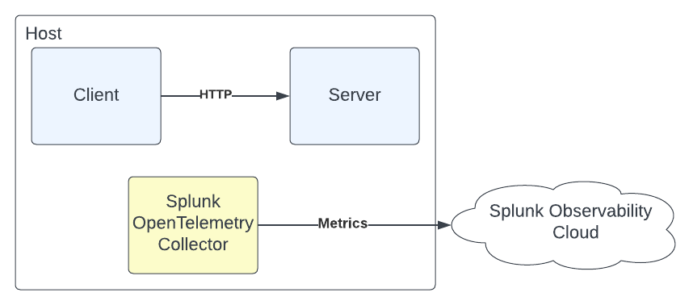
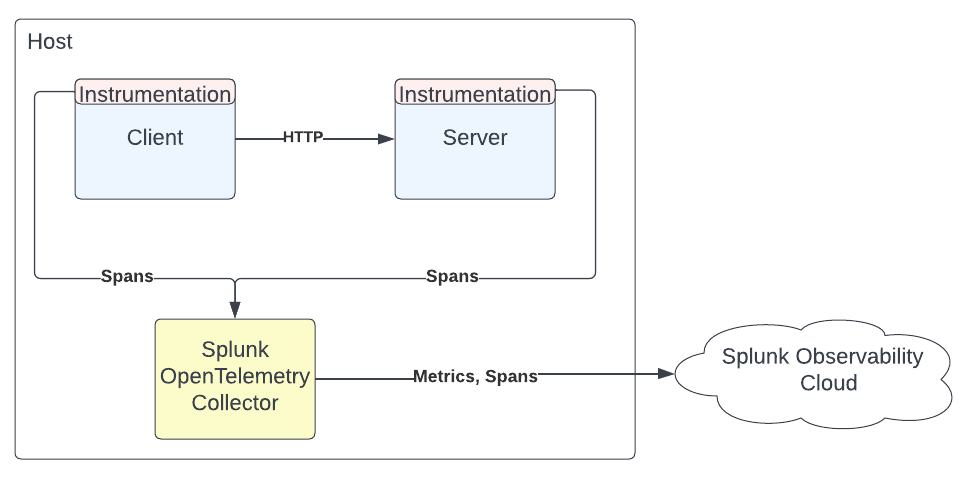
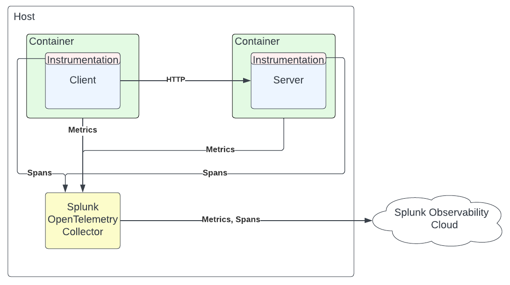

# Containerization Workshop

This workshop is designed to explore how to build and run simple containers and how to make them work with Splunk Observability Cloud. This is a technical workshop, which emphasizes starting with basics and strives to limit the amount of copy, paste and complete that is done.

In the workshop, we will create two services in python (1) a client which is making http requests to (2) a server. Next, the services will both be containerized, instrumented and monitored with Splunk IM & APM.

*_Prerequisites_*
* Docker Installed ([Mac](https://docs.docker.com/desktop/mac/install/) or [Windows](https://docs.docker.com/desktop/windows/install/) or [Ubuntu](https://docs.docker.com/engine/install/ubuntu/))
* [Python 3 Installed](https://www.python.org/downloads/), python 3 should be installed by default on a fresh Ubuntu VM.
* pip3 Installed with `sudo apt install python3-pip`

## Part 1: Starting from Scratch

First, let's make sure we can monitor everything happening on this host by installing the Splunk OpenTelemetry Collector. In the O11y suite, go to Data Management > Add Integration > Deploy the Splunk OpenTelemetry Collector and follow the wizard.

After installing, the host metrics will be found under Infrastructure Monitoring and the collector itself can be monitored under Dashboards > OpenTelemetry Collector.

Clone this repository with
```
git clone https://github.com/cordishall-splunk/o11y-examples.git
```

Navigate to this workshop's directory with
```
cd o11y-examples/Containerization\ Workshop
```

### Build a foundation

In this section we will be running a simple client server application on an EC2 instance. The host will be monitored with OpenTelemetry Collector and each python service will be instrumented to send traces to the collector locally before all data is sent to Splunk's Observability Cloud.



To start with create the python client and server. Use the examples in their respectively named directories, or create your own. In one terminal, install the listed dependencies and run the server

```
pip install -r requirements.txt
export PATH=$PATH:/home/ubuntu/.local/bin
python3 -m flask run
```

In another terminal, run the client

```
pip install -r requirements.txt
export PATH=$PATH:/home/ubuntu/.local/bin
python3 client.py
```

If done correctly, the client should now be constantly logging status codes. While this is a rather boring example, we can see the increase in network i/o metrics in real time! Stop both services with cntrl + c.

### Instrumentation

Time to add instrumentation to these python services (highlighted in below diagram). Go to Data Management > Add Integration > Monitor applications > Python (OpenTelemetry) and follow the wizard to instrument both services. Follow the wizard and any linked documentation as needed. Some notes,



* Environmental variables can be set by running `./env.sh`, edit the file to your specific Environment name first!
* Install requirements with `pip install -r requirements.txt`
* Feel free to use and modify `run-client.sh` and `run-server.sh` to preserver your runtime commands and any instrumentation.
* If you get a `command not found error` when runnning `splunk-py-trace-bootstrap`, a host restart may be required

You should now be able to see received and exported spans on the OpenTelemetry Collector dashboard and a service map in APM. APM can take ~3 minutes to update the service map, so be patient and think about where else we might be able to validate our instrumentation is working, both locally and in the o11y suite.

### Troubleshooting

Looking at APM, where do you see errors? Where are they coming from? How can we use the guided troubleshooting in APM to better understand?

## Part 2: Containerize it

In this part, each service will be built into a container image and re-deployed. Note, installing docker with the recommended ubuntu steps linked above requires prefixing any `docker` command with `sudo`.



### Build Container Images

First, a _container image_ needs to be created. Container images can be created by selecting a base image and then defining the startup conditions -- the idea is to install the bare minimum needed for the service to run.

There are already dockerfiles in the client and server directories to use. Edit the ALL CAPS fields to your specific values.

What's happening in these `dockerfiles`?
1. Starting with a base python image
1. Creating a working directory, `app` to work out of
1. Setting environmental variables
1. Copy from the non-container directory, `requirements.txt` to a file in the container `requirements.txt`
1. Install all of the needed python packages
1. Get all of the files in the non-container directory and put them  in the container.
1. Run the same execution command as was done in Part 1.

Last, build the containers _images_. Use the `tag` parameter to give the container images names For the client,

```
docker build --tag client-py .
```

For the server,

```
docker build --tag server-py .
```

Verify the images were properly created with `docker images`, which should output like below.

```
REPOSITORY                               TAG       IMAGE ID       CREATED          SIZE
client-py                                latest    42e7d117264d   4 seconds ago    123MB
server-py                                latest    25c0b5be7935   8 minutes ago    125MB
```
 
### Run the containers standalone

The container images must now be ran and configured to talk to one another. For the server container, ports on the container must be mapped to the host using the `--publish` flag, this way if a request is made to port 5000 on the host, the container will also be listening on that port. Start the server with,

```
docker run --publish 5000:5000 server-py
```

The client doesn't need the same port mappings to make requests, however, the network must set to the host. Technically, this is unsupported on Docker for Mac, but for this purpose it suffices.

```
docker run --network="host" client-py
```

Validate success by seeing `200`s in the server container's logs.

```
172.17.0.1 - - [16/Dec/2021 16:47:00] "POST /echo?key=value HTTP/1.1" 200 -
```
### Monitor the Containers

Follow the [Docker Containers](https://docs.splunk.com/observability/en/gdi/monitors-hosts/docker.html) doc to add a new receiver to our locally running collector and the metrics pipeline. Our final data flow diagram looks like,

When viewing the docker dashboard, container names can be found by running `docker ps`.


### Run the containers with docker-compose

Docker compose allows for multi-container applications to be run with a single command. That way, there isn't a need to specify using the host's network or to run disparate commands. Instead, all of the configurations will be defined in one yaml file. In the root directory of the project, create a new file `docker-compose.yaml` with the below contents. For use with `docker-compose` the client request url must be changed in `client.py` to `http://server:5000/echo`.

```
version: '3.8'

services:
  server:
    build: ./server
    ports: 
    - 5000:5000
  client:
    build: ./client
```

Re-build the containers and run with a single command:

```
docker compose build
docker compose up
```

## Part 3: Infrastructure Monitoring

In this part, an OpenTelemetry Collector will be deployed to collect infrastructure metrics about the running containers. Add another service to the `docker-compose.yaml` file. Create env variables or replace `${SPLUNK_ACCESS_TOKEN}` and `${SPLUNK_REALM}` with appropriate values.

```
splunk-otel-collector:
    image: quay.io/signalfx/splunk-otel-collector:latest
    environment:
      - SPLUNK_ACCESS_TOKEN=${SPLUNK_ACCESS_TOKEN}
      - SPLUNK_REALM=${SPLUNK_REALM}
    ports:
      - "13133:13133"
      - "14250:14250"
      - "14268:14268"
      - "4317:4317"
      - "6060:6060"
      - "8888:8888"
      - "9080:9080"
      - "9411:9411"
      - "9943:9943"
```

### OpenTelemetry Metric Configuration

The OpenTelemetry Collector can be configured in _many_ ways, this is awesome! However, it's a double edged sword as things can quickly get complicated. One benefit to using the Splunk distribution of the OpenTelemetry Collector is that it is preconfigured to work out-of-the-box with Splunk Observability Cloud. In this case, simply following the example documentation creates an immediately usable configuration.

## Part 4: Application Monitoring

In this part the application will be instrumented so the traces can be viewed in Splunk APM. Each service will be auto-instrumented to send traces to the OpenTelemetry Collector configured in part 3, which will then send those traces to Splunk APM.

### Instrumentation

Look at the docs for instrumenting a python application and consider how the python service is being ran (see Data Setup > APM Instrumentation > Python). This amounts to simply making an adjustment to the dockerfile: installing the tracer and updating the run command. Consider what is shown on the _APM Instrumentation_ for Python auto-instrumentation and update the dockerfile accordingly.

```
...
RUN pip3 install splunk-opentelemetry[all]
RUN splunk-py-trace-bootstrap

...

CMD ["splunk-py-trace" ...
```
